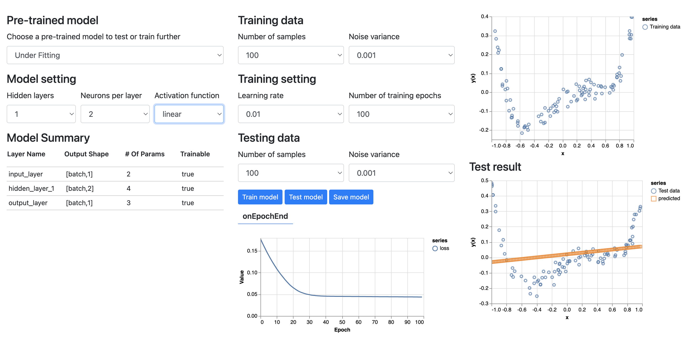
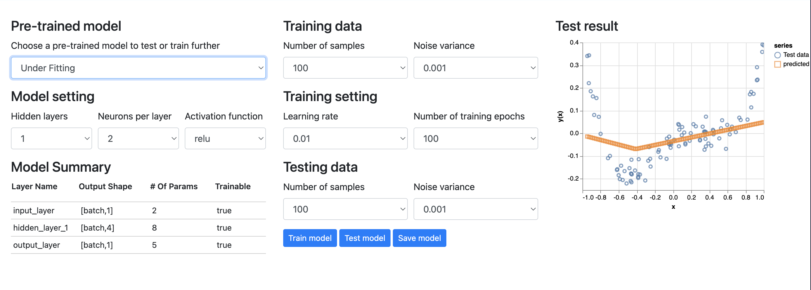
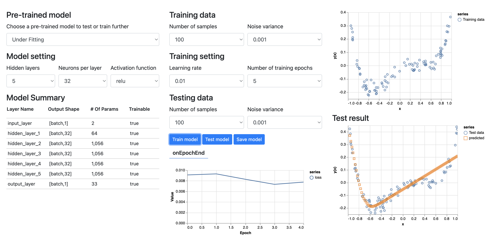
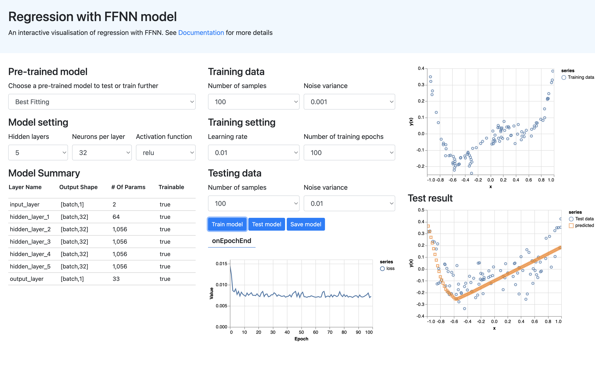

# Regression with FFNN
An interactive visualisation of regression learning with feed-forward neural network (FFNN) model using the [Tensorflow.js](https://www.tensorflow.org/js/) framework

## How to use
- Go to [Regression with FFNN](https://vquynh.github.io/ffnn-regression/)
- **To test or train a pre-trained model further**:
  - Select a model from the model list: "Under Fitting", "Best Fitting", "Over Fitting"
  - Change the training/testing data as desired. Each change will trigger a new training/testing
    - `Samples`: number of [x,y] value pairs (N)
    - `Noise variance`: the amplitude of the noise added to the y value, the higher the value the less uniform the data graph will look compared to the actual graph of the function
  - Change the training setting
    - `Learning rate`: metaphorically represents the speed at which a machine learning model "learns". 
    It determines the step size at each iteration while moving toward a minimum of a loss function. Higher rate means
    faster learning but also higher risk of jumping over minima
    - `Number of training epochs`: number of cycles the neural network train with all the training data. 
    Higher number of epochs means more thoroughly training data is learned which is better when the data is complicated.
  - Click on `Train model`/ `Test model` to train/test model with the current setting.
  - Click on `Save model` to save and download the current model to your computer.
- **To design a new model**:
  - Choose the desired parameters:
    - `Hidden layers`: number of hidden layers in the neural network, more layers means more complex network
    - `Neurons per layer`: number of neurons per hidden layer, the higher the number, the more sensitive the network is to complicated data
    - `Activation function`: the activation function to be used in the hidden layer, which defines the output of a node given the input(s). `relu` function seems to work the best with the given data.

## How it is built

### Generating the training/testing data
- The data set is created by generating N random [x,y] value pairs in with real x in range [-1,1] and `y = y = (x+0.8)*(x-0.2)*(x-0.3)*(x-0.6) + noise` with `noise` being
```javascript
function getRandomNoise(variance) {
    let u = 0, v = 0;
    while(u === 0) u = Math.random(); //Converting [0,1) to (0,1)
    while(v === 0) v = Math.random();
    const number = Math.sqrt( -2.0 * Math.log( u ) ) * Math.cos( 2.0 * Math.PI * v );
    return Math.sqrt(variance)*number;
}
```
The implementation is based on [this answer by Maxwell Collard on StackOverflow](https://stackoverflow.com/a/36481059).

### Create the neural network model
The [tensorflow.js](https://www.tensorflow.org/js) is used to create a model based on the given setting:
```javascript
function createModel() {
    // Create a sequential model
    const model = tf.sequential();

    // Add a single input layer
    model.add(tf.layers.dense({inputShape: [1], units: 1, useBias: true, name: "input_layer"}));

    // Add n hidden layers with given number of neurons and activation function
    for (let i = 0; i < nLayers; i++) {
        model.add(tf.layers.dense({
            units: neurons,
            useBias: true,
            activation: activation,
            name: "hidden_layer_" + (i + 1)
        }));
    }

    // Add an output layer
    model.add(tf.layers.dense({units: 1, useBias: true, name: "output_layer"}));

    return model;
}
```
### Train the model
The model is trained based on the generated training data and training setting.
```javascript
    // Generate training data
    const trainingData = getData(trainingSamples, trainingVariance);
    // Convert the data to a form we can use for training.
    const tensorData = convertToTensor(trainingData);
    const {inputs, labels} = tensorData;
    
    await model.compile({
        optimizer: tf.train.adam(),
        loss: tf.losses.meanSquaredError,
        metrics: ['mse','accuracy'],
    });

    const batchSize = 32;

    // Train model
    await model.fit(inputs, labels, {
        batchSize,
        epochs,
        shuffle: true,
        callbacks: plotLossGraph()       
    });
```

### Save and load pre-trained models
Tensorflow allows model to be saved and downloaded.
```javascript
async function saveModel(){
    await model.save('downloads://my-model');
}
```
### Experiments and interpretation
#### Under-fitting
There are multiple examples of under-fitting
- **Under-fitting due to unsuitable activation function**

  The activation function `linear` is not sufficient for the training data.

- **Under-fitting due to too simple model**

The activation function `relu` is better than `linear` but the model with 1 hidden layer and 2 neurons per layer is 
still not sophisticated enough to predict the data and over-simplifies the trend.

- **Under-fitting due to lack of training**
  
In this example, the model parameters are improved and look promising, but the number of epochs = 5 is too small
so the model couldn't learn the training data thoroughly and optimise the weights to best fit the data.

#### Best-fitting
Best-fitting was achieved by combining suitable network design with sufficient training
- Since it is shown about, that the `ReLU` activation function works quite well on the dataset, next step is to find the suitable
number of hidden layers and neurons per layer. Technically, each layer can have a different setting but for the sake of simplicity
in the implementation, the same setting is applied on all hidden layers.
- After trying out a number of combination, *5 hidden layers* with *32 neurons per layer* seems to work the best.
  - After the first training, the result is not yet optimal
    
  - However, after 10 trainings, each with a different set of `N = 100 samples of data` and trained at `learning rate = 0.01` for `100 training epochs`,
the model became more accurate.
    

#### Over-fitting
Similar to under-fitting, over-fitting can happen for multiple reasons.
- Over-fitting due to too complex model
- Over-fitting due to lack of training data
- Over-fitting due to over training of the same data

### Tools
- [Tensorjs](https://www.tensorflow.org/js) for creating, training, saving and loading models
- [tfs-vis](https://js.tensorflow.org/api_vis/1.5.1/) for visualising model
- [Bootstrap](https://getbootstrap.com/docs/5.0/getting-started/introduction/) for styling the HTML page
### References
- [Tutorial: TensorFlow.js — Making Predictions from 2D Data](https://codelabs.developers.google.com/codelabs/tfjs-training-regression/index.html)
- [Visualisation of function y = (x+0.8)*(x-0.2)*(x-0.3)*(x-0.6)](https://www.desmos.com/calculator)
- [Generating gaussian random in javascript](https://stackoverflow.com/questions/25582882/javascript-math-random-normal-distribution-gaussian-bell-curve)
- [How to choose number of hidden layers and nodes in  feedforward neural network](https://stats.stackexchange.com/questions/181/how-to-choose-the-number-of-hidden-layers-and-nodes-in-a-feedforward-neural-netw)


